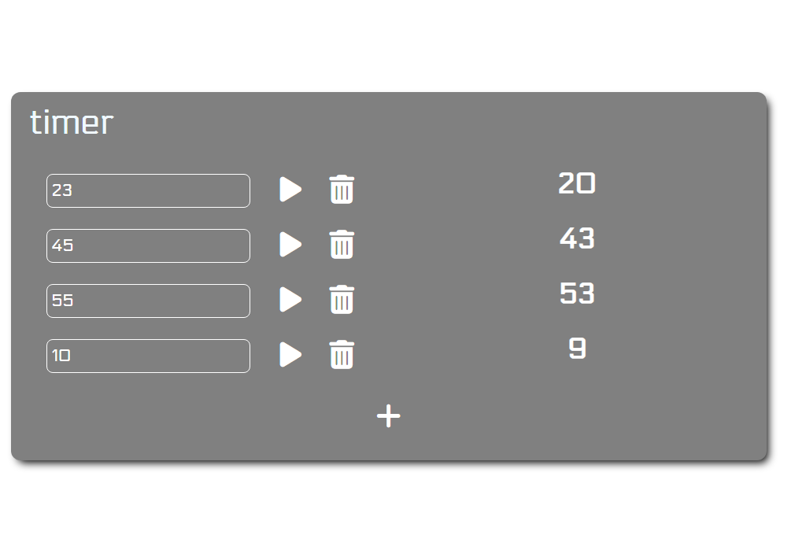

## Table of contents

- [Overview](#overview)
  - [Screenshot](#screenshot)
  - [Links](#links)
- [instructions](#instructions)
  - [Add timers](#add-timers)
  - [Start timers](#start-timers)Some timers
  - [Some timers](#some-timers)
  - [Delete timers](#delete-timers)
  - [Restart timers](#restart-timers)
  - [Note](#note)
- [Author](#author)

## Overview

### Screenshot

### Links

- Solution URL: [Add solution URL here](https://github.com/LizunYuri/habr-timer)
- Live Site URL: [Add live site URL here](https://github.com/LizunYuri/)

## Instructions

### Add timers 
Добавление таймера:

Для создания нового таймера нажмите кнопку с иконкой + внизу страницы.
Новый таймер появится на странице. Вы можете добавить любое количество таймеров.
Настройка таймера:

В поле ввода таймера введите число, указывающее время отсчёта в секундах (например, 10 для 10 секунд).

Убедитесь, что введено положительное целое число.

### Start timers 
Запуск таймера:

Нажмите кнопку с иконкой "Пуск" (⏵) рядом с полем ввода. Таймер начнёт обратный отсчёт.
Таймер отображает оставшееся время в формате:  X.

### Some timers
Работа нескольких таймеров:

Вы можете запустить несколько таймеров одновременно. Каждый из них работает независимо.
Таймеры будут продолжать отсчёт, даже если вы добавите новые таймеры.

### Delete timers
Удаление таймера:

Чтобы удалить таймер вручную, нажмите кнопку с иконкой мусорного ведра рядом с таймером.
Если таймер завершит отсчёт, он удалится автоматически.

### Restart timers
Повторный запуск:

Если вы хотите повторно использовать таймер после удаления или завершения, добавьте новый таймер с помощью кнопки +.

### Note 

Примечания:
Если вы ввели некорректное значение (например, текст или отрицательное число), появится предупреждение с просьбой ввести корректное время.
Таймеры запускаются только один раз и не перезапускаются после завершения. Для повторного использования добавьте новый таймер.

## Author

- Website - [b_Root](https://www.build-root.ru)

